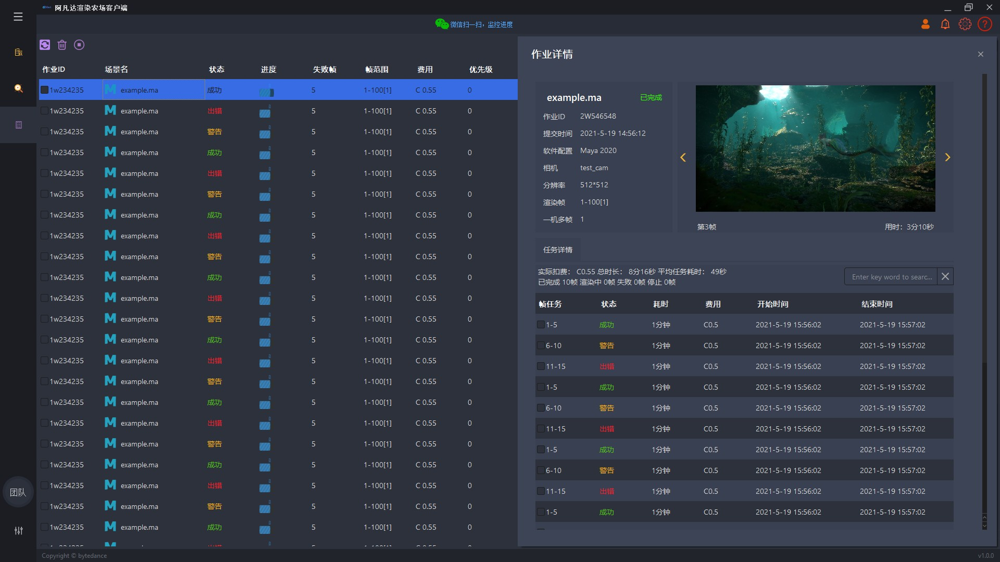

# RenderFarmManagementDemo
a pyside demo for building your cloud render farm management system
based on https://github.com/phenom-films/dayu_widgets and https://github.com/Wanderson-Magalhaes/PyOneDark_Qt_Widgets_Modern_GUI
show reel: https://www.youtube.com/watch?v=-yRjdn6bzhI
# how to use
python3 main.py

